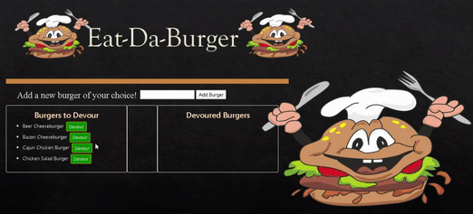

# Eat-Da-Burger
Eat-Da-Burger is a restaurant app that lets users input the names of burgers they'd like to eat.

It is a simple full stack application that follows the MVC (model view controller) framework. The app utilizes express routing, handlebars.js, and stores data in a MySQL database. It is is very simple - there are two columns listed as "burgers ready for devouring," and "devoured burgers." Burgers listed as ready to be devoured have a button next to them called Devour! Clicking this will move the burger into the devoured burgers column.

## Demo

Live Link: https://burger-amitabh.herokuapp.com//

## Description
A burger logger with MySQL, Node, Express, Handlebars and a homemade ORM.

## Table of Contents
* [Getting Started](#Getting-Started)
* [Credits](#credits)
* [Technologies](#Technologies)

## Getting Started

#### App Setup

1. Create a GitHub repo called `burger` and clone it to your computer.

2. Make a package.json file by running `npm init` from the command line.

3. Install the Express npm package: `npm install express`.

4. Create a server.js file.

5. Install the Handlebars npm package: `npm install express-handlebars`.

6. Install MySQL npm package: `npm install mysql`.

7. Require the following npm packages inside of the server.js file:
   * express

#### DB Setup

1. Inside your `burger` directory, create a folder named `db`.

2. In the `db` folder, create a file named `schema.sql`. Write SQL queries this file that do the following:

   * Create the `burgers_db`.
   * Switch to or use the `burgers_db`.
   * Create a `burgers` table with these fields:
     * **id**: an auto incrementing int that serves as the primary key.
     * **burger_name**: a string.
     * **devoured**: a boolean.

# Technologies
The app's database schema and seeds were created in the MySQL workbench, and the coding was done in VS Code using node.js, JavaScript, handlebars.js, and Express. A custom ORM was also utilized. CSS, Bootstrap and Google Fonts were used for the styling of the app.

## Credits
[UofTBootCamp](https://bootcamp.learn.utoronto.ca/coding/?utm_source=pardot&utm_campaign=cln_coding_new_em8&utm_medium=email&utm_term=cta-btn)
